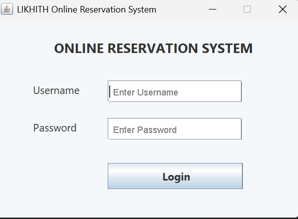
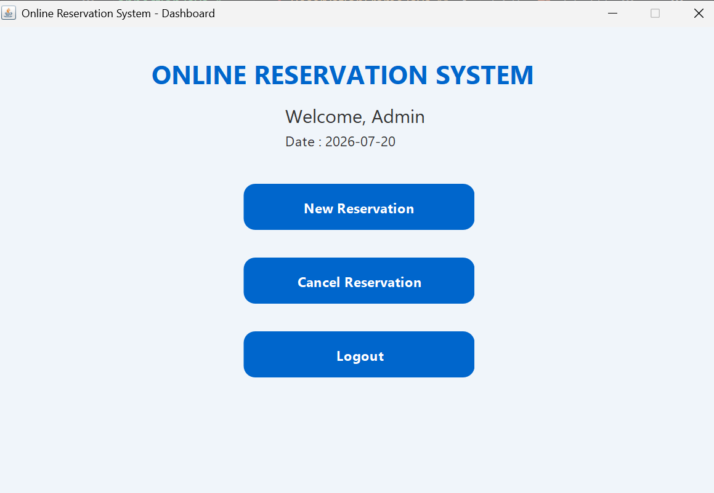
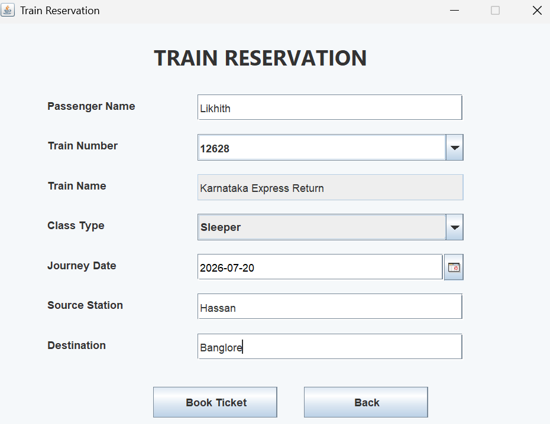
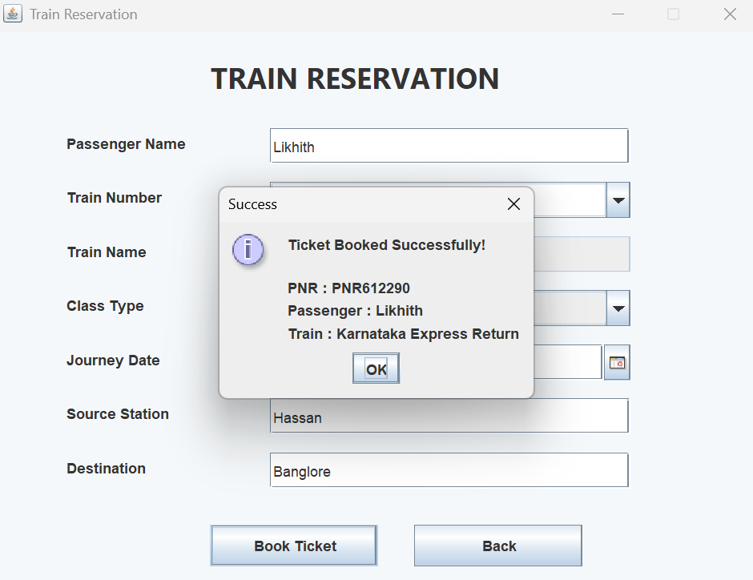
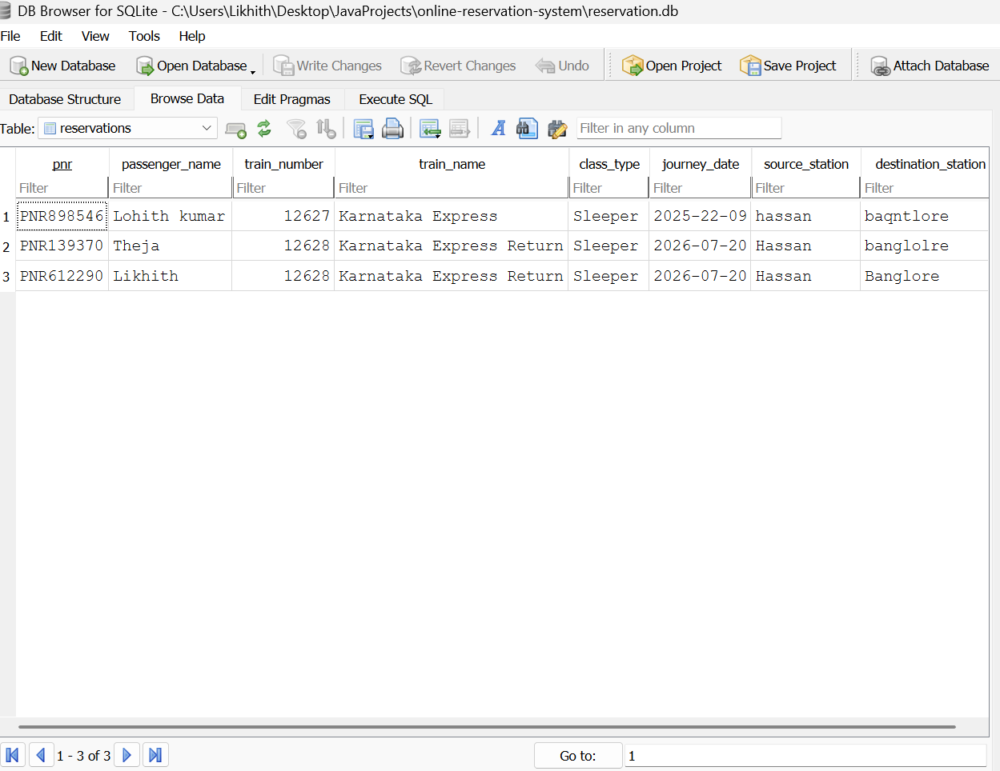
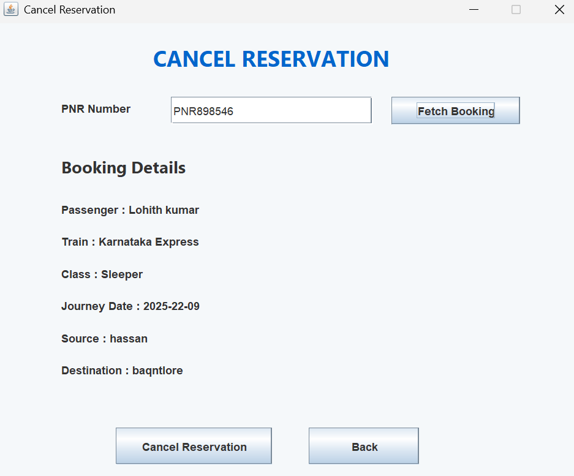
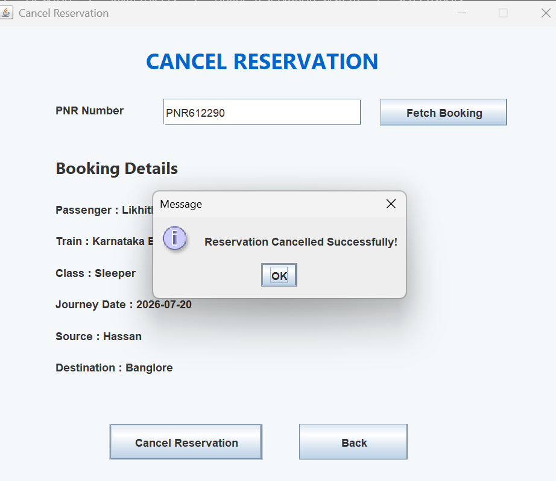

# Online Reservation System

# 📖 Project Overview

The **Online Reservation System** is a desktop-based Java application developed using **Java Swing**, **SQLite**, **JDBC**, and **Maven**. It provides a secure login system, train ticket reservation, automatic PNR generation, ticket cancellation, and database management through an interactive graphical user interface.

---

# ✨ Features

## 🔐 Login Module

- Secure Admin Login
- Username Placeholder
- Password Placeholder
- Password Length Validation
- Login Authentication

---

## 🚆 Reservation Module

- Searchable Train Number Dropdown
- Auto Suggestion for Train Numbers
- Automatic Train Name Detection
- Train Not Found Validation
- Automatic PNR Generation
- Journey Date Picker
- Source & Destination Validation
- Booking Confirmation

---

## ❌ Cancellation Module

- Cancel Ticket using PNR
- Instant Cancellation Confirmation
- Database Record Removal

---

## 💾 Database

- SQLite Database
- Automatic Database Initialization
- Reservation Storage
- JDBC Connectivity

---

# 🛠 Technologies Used

- Java
- Swing
- SQLite
- JDBC
- Maven
- Git
- GitHub

---

# 🔑 Default Login

| Username | Password |
|----------|----------|
| admin | admin123 |

---

# 🚀 How to Run

### Clone Repository

```bash
git clone https://github.com/likhith-likhith/Java_Development-Learning.git
```

### Open Project

```bash
cd Java_Development-Learning/JavaDevelopment-OnlineReservationSystem
```

### Compile

```bash
mvn clean compile
```

### Run

```bash
mvn exec:java "-Dexec.mainClass=com.likhith.reservation.Main"
```

---

# 📸 Application Screenshots

## 1️⃣ Login Page



---

## 2️⃣ Dashboard



---

## 3️⃣ Train Reservation



---

## 4️⃣ Booking Successful



---

## 5️⃣ Reservation Stored in Database



---

## 6️⃣ Ticket Cancellation



---

## 7️⃣ Cancellation Successful



---

## 8️⃣ Database After Cancellation


---

# 📂 Project Structure

```
OIBSIP
│
└── JavaDevelopment-OnlineReservationSystem
    │
    ├── screenshots
    │   ├── 01-login.png
    │   ├── 02-dashboard.png
    │   ├── 03-booking.png
    │   ├── 04-booking-success.png
    │   ├── 05-after-reservation-database.png
    │   ├── 06-cancellation.png
    │   ├── 07-cancellation-success.png
    │   └── 08-after-cancel_reservation-database.png
    │
    ├── src
    ├── reservation.db
    ├── pom.xml
    ├── README.md
    └── .gitignore
```

---

# 🔮 Future Enhancements

- User Registration
- Seat Availability
- Fare Calculation
- Payment Gateway
- Email Notification
- SMS Notification
- Admin Panel
- Booking History
- Train Schedule Management