# 🏦 ATM Interface

## Oasis Infobyte Internship

### 👨‍💻 Name
**Likhith**

### 📚 Track
**Java Development**

### ✅ Task
**Task 2 - ATM Interface**

---

# 📌 Project Description

The ATM Interface is a Java Swing-based desktop application developed as part of the Oasis Infobyte Java Development Internship. It simulates the core functionalities of an Automated Teller Machine (ATM), allowing users to securely log in using a User ID and PIN and perform various banking operations through a professional graphical user interface.

The project is developed using Java Object-Oriented Programming (OOP) concepts and Java Swing, providing a realistic banking experience with proper validation, transaction management, and user-friendly navigation.

---

# ✨ Features

- 🔐 Secure Login using User ID & PIN
- 🔒 Maximum 3 Login Attempts
- 🏠 Professional Dashboard
- 💰 Check Current Balance
- ➕ Deposit Money
- ➖ Withdraw Money
- 🔄 Transfer Money Between Accounts
- 📜 Transaction History
- 🕒 Live Date & Time Display
- 🚪 Logout
- ❌ Exit Confirmation
- 🎨 Modern Java Swing User Interface
- ☕ Developed using Java OOP Principles

---

# 🛠 Technologies Used

- Java
- Java Swing
- Object-Oriented Programming (OOP)
- ArrayList
- VS Code

---

# 📂 Project Structure

```text
JavaDevelopment-Task2-ATMInterface
│
├── src
│   └── com
│       └── likhith
│           └── atm
│               ├── Account.java
│               ├── ATM.java
│               ├── Bank.java
│               ├── Main.java
│               ├── Transaction.java
│               │
│               └── gui
│                   ├── LoginFrame.java
│                   ├── DashboardFrame.java
│                   ├── DepositFrame.java
│                   ├── WithdrawFrame.java
│                   ├── TransferFrame.java
│                   ├── HistoryFrame.java
│                   ├── PlaceholderTextField.java
│                   └── PlaceholderPasswordField.java
│
├── screenshots
│
├── README.md
│
└── bin
```

---

# 🚀 How to Run

### 1️⃣ Compile the Project

```bash
javac -d bin src\com\likhith\atm\*.java src\com\likhith\atm\gui\*.java
```

### 2️⃣ Run the Project

```bash
java -cp bin com.likhith.atm.Main
```

---

# 🔑 Default Login Credentials

## User 1

| User ID | PIN |
|----------|-----|
| user1 | 1234 |

---

## User 2

| User ID | PIN |
|----------|-----|
| user2 | 4321 |

---

# 📸 Application Screenshots

## 1. Login Screen (User 1)

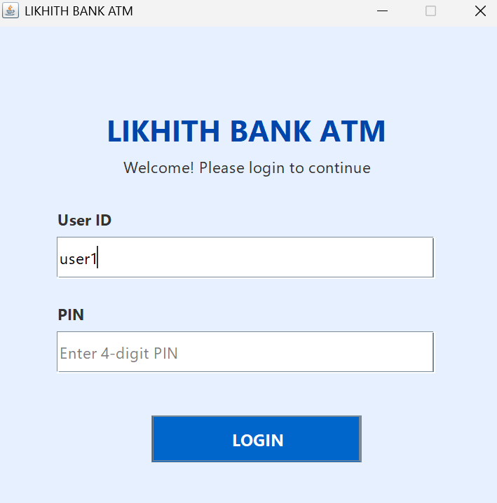

---

## 2. Dashboard (User 1)

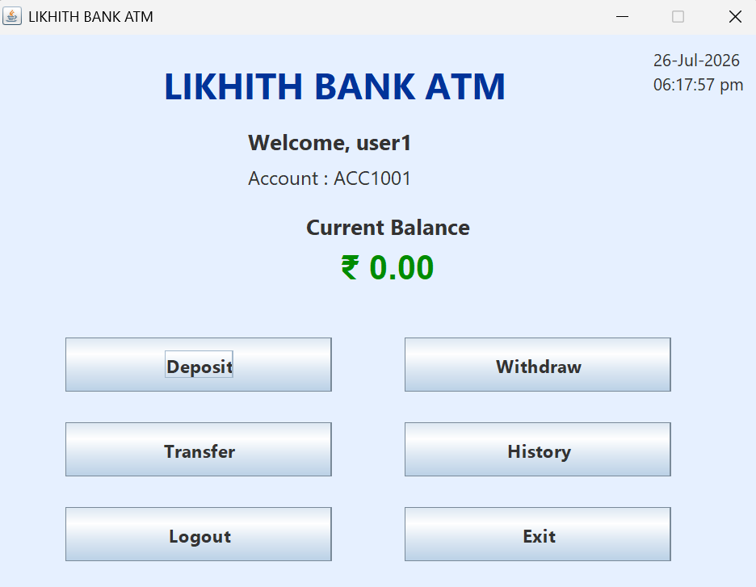

---

## 3. Before Deposit

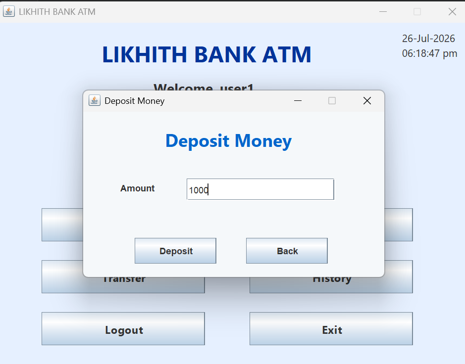

---

## 4. After Deposit

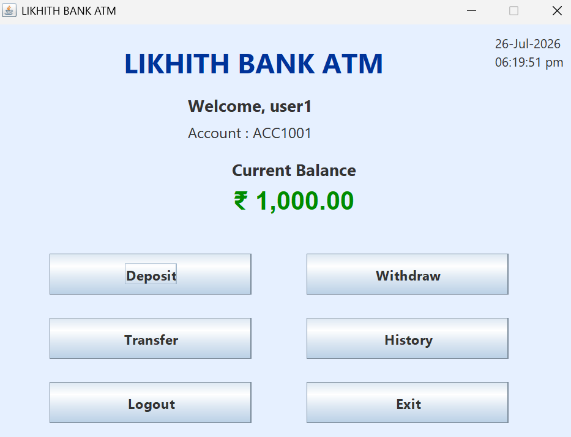

---

## 5. Before Withdrawal

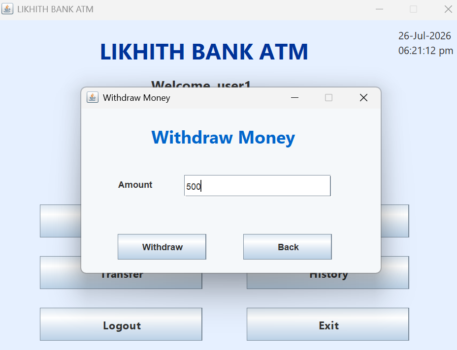

---

## 6. After Withdrawal

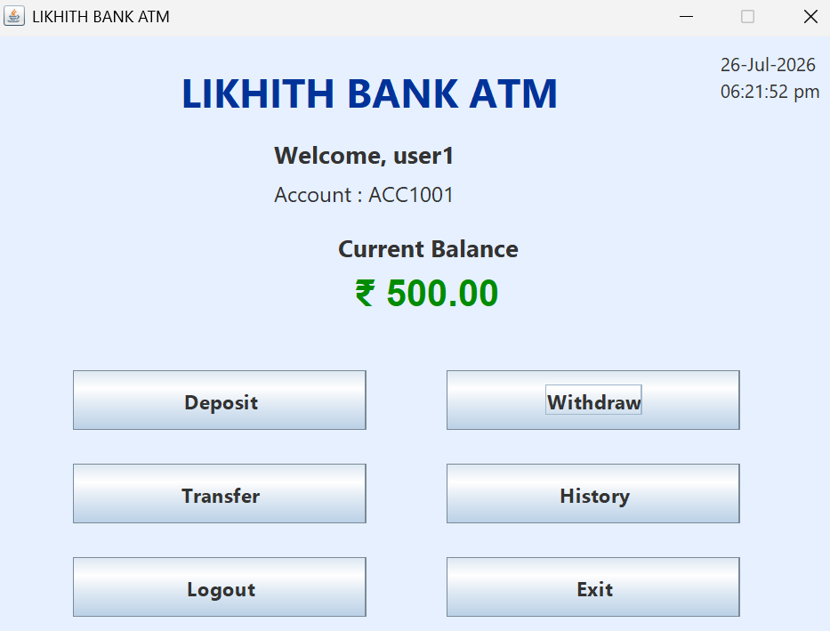

---

## 7. Transfer Money (User 1 → User 2)

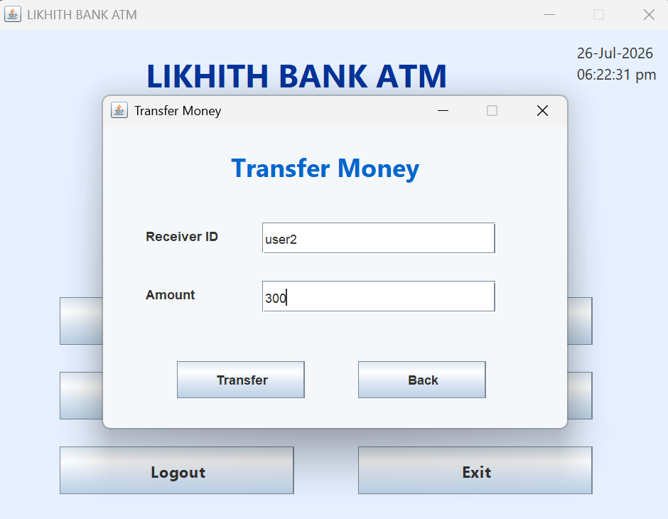

---

## 8. User 1 Dashboard After Transfer

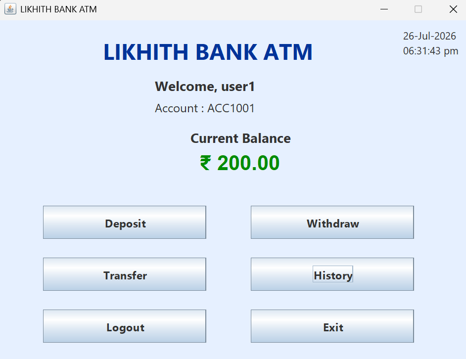

---

## 9. Login Screen (User 2)

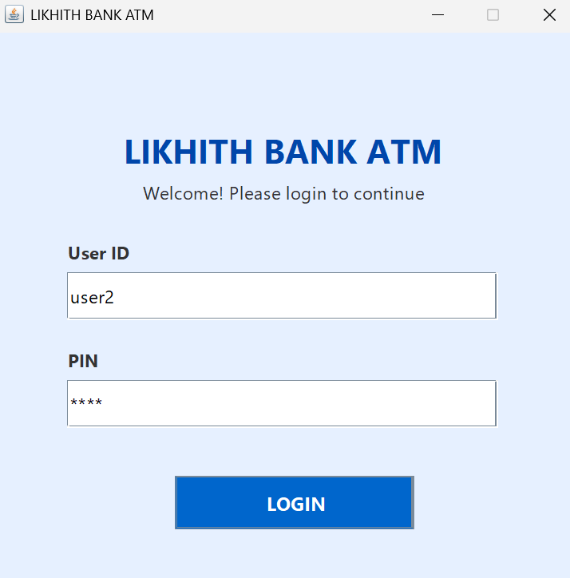

---

## 10. Dashboard (User 2)

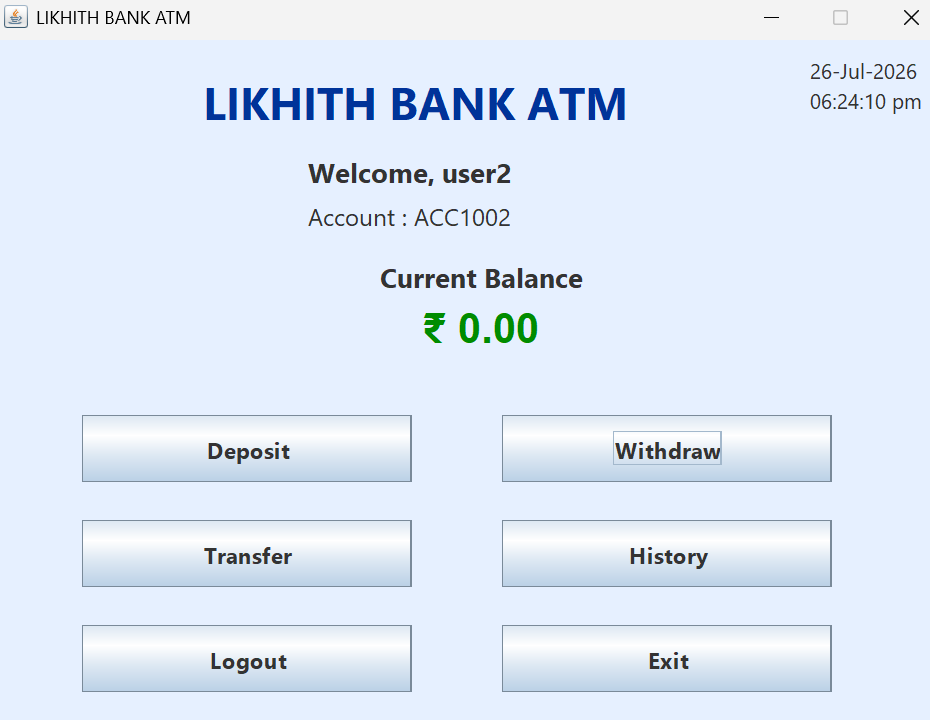

---

## 11. User 2 Balance After Receiving Money

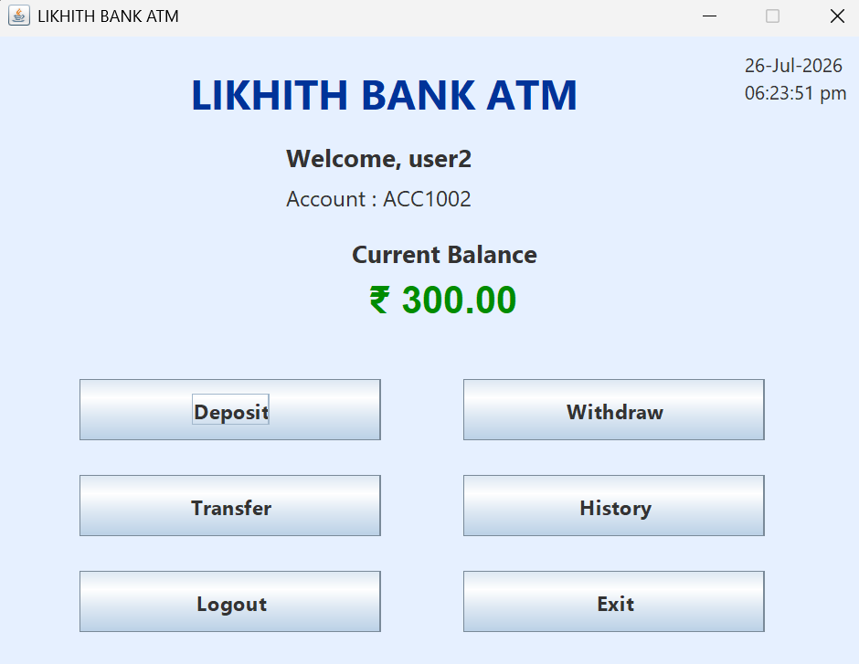

---

## 12. Transaction History

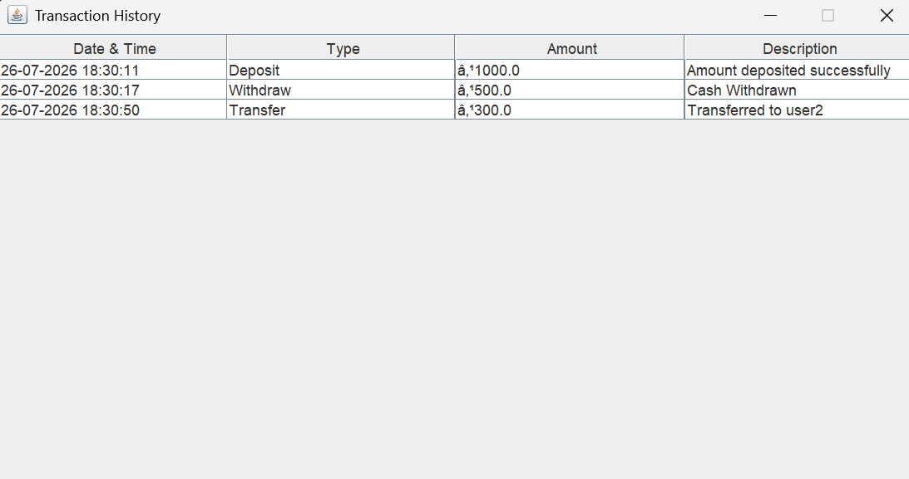

---

## 13. Logout

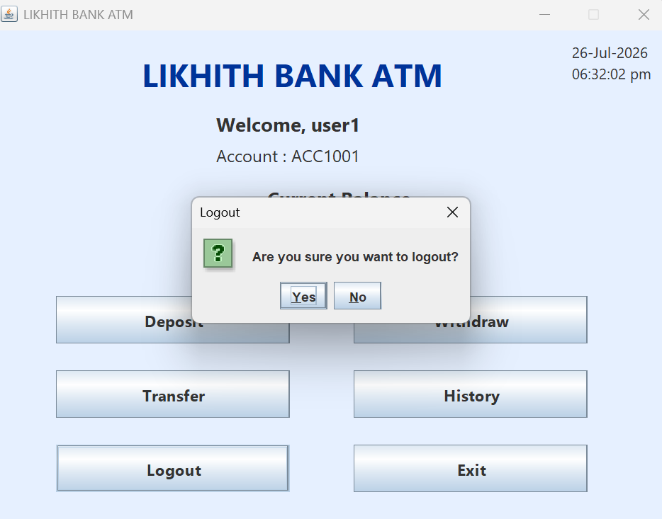

---

## 14. Exit

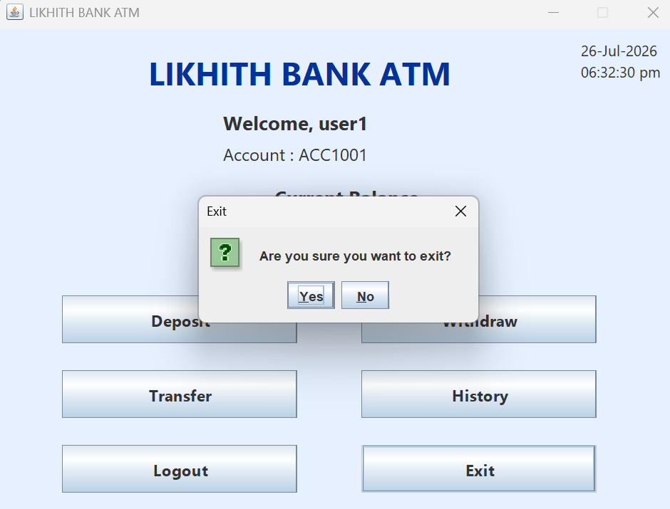

---

# 🎯 Learning Outcomes

- Java Object-Oriented Programming
- Java Swing GUI Development
- Event Handling
- ArrayList
- Banking Transaction Management
- User Authentication
- Multi-Class Project Design
- GUI-based Desktop Application Development

---

# 📌 Internship Information

**Organization:** Oasis Infobyte

**Track:** Java Development

**Task:** Task 2 – ATM Interface

---

# 👨‍💻 Developed By

**Likhith**

Java Development Intern

Oasis Infobyte